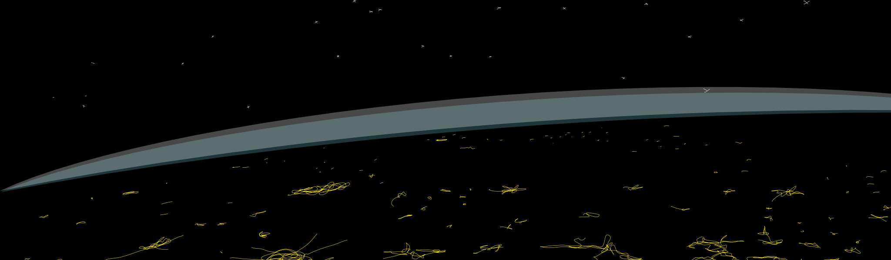
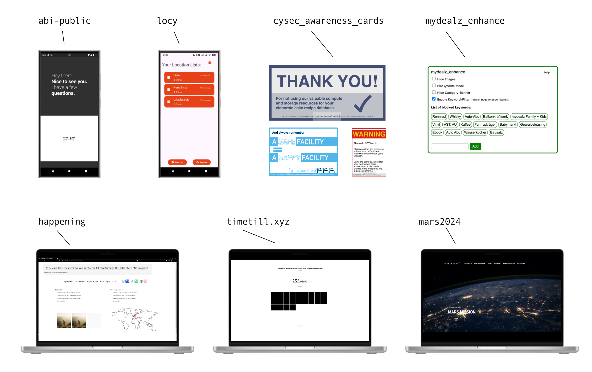
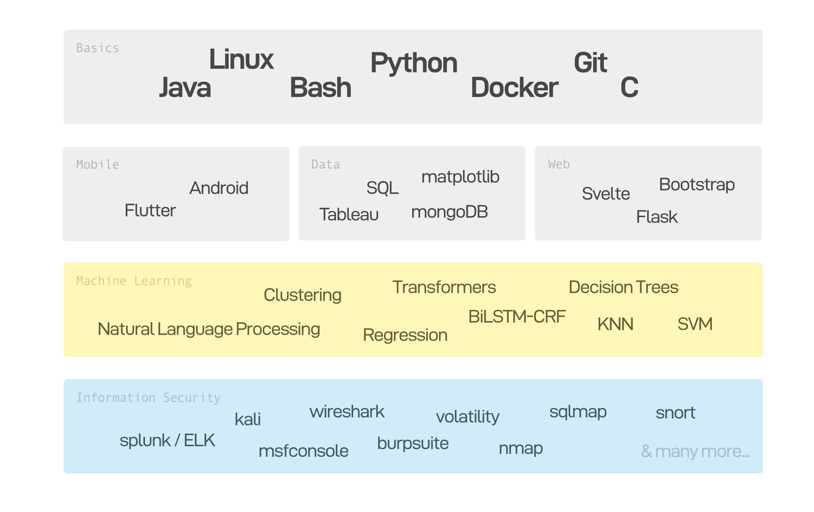

<!-- put text over this image saying "Oh hey!" with the subtitle "Here's a casual 'hi' from me." -->

 

### About me

<pre>
    💼 Human • MSc @ TU Darmstadt • IT Security • Student
    💻 Passionate about Information Security 
    🌱 Learning about SIEM & Incident Reponse
    📫 Reach me via LinkedIn • https://www.linkedin.com/in/r-erd/
    ⬜ Minimalism • Linux > Windows • Sports • Reading • Gaming
</pre>

  
### Cyber Security 

  
  

## Projects

## Languages & Tools

